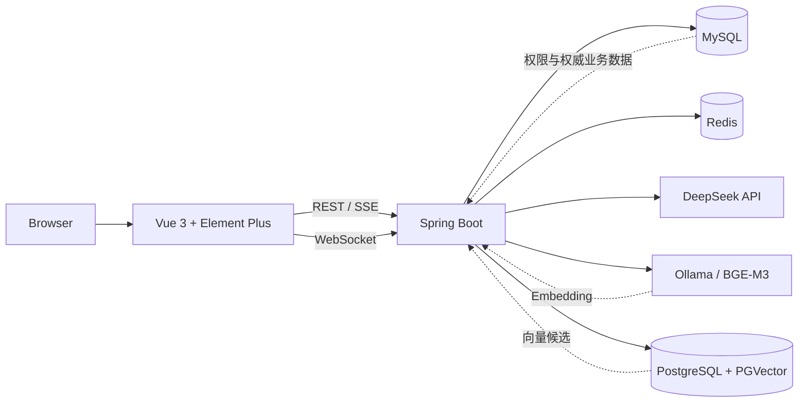

<div align="center">

# Enterprise Realtime Chat & Knowledge Assistant

面向企业内部协作的实时通讯录、即时通信与可追溯 AI 知识助手。

[](https://openjdk.org/)
[](https://spring.io/projects/spring-boot)
[](https://vuejs.org/)
[](https://www.mysql.com/)
[](https://redis.io/)
[](#ai-知识助手)

</div>

## 项目概览

本项目将企业通讯录、组织架构和实时聊天整合在同一套前后端系统中，并在业务权限之上扩展 AI 知识助手。助手支持 DeepSeek 流式对话、公告与个人文档检索、可选的本地向量化，以及基于真实群消息的摘要和行动项提取。

项目强调三件事：**回答有来源、检索受权限约束、AI 故障不影响基础协作功能**。

## 核心能力

| 模块 | 能力 |
| --- | --- |
| 企业通讯录 | 部门组织架构、内部成员、外部联系人、常用联系人 |
| 实时通信 | 私聊、群聊、在线状态、离线消息与 WebSocket 推送 |
| 协作信息 | 企业公告、群公告、系统通知与数据统计 |
| AI 对话 | DeepSeek 多轮问答、SSE 流式输出、停止生成、重试、Token 与耗时展示 |
| 知识问答 | 已发布公告和个人 TXT/Markdown 文档检索，返回引用并在查看原文时重新鉴权 |
| 向量 RAG | 可选 Ollama + BGE-M3 + PGVector，支持索引同步、相似度阈值和过期索引校验 |
| 群聊摘要 | 按群与时间范围总结消息、提取行动项，过滤撤回消息并校验引用来源 |

## 系统架构



MySQL 始终是用户、权限和业务内容的权威数据源；PGVector 只保存检索副本。向量命中后，后端仍会依据当前用户权限、原文状态和内容指纹复查，避免旧索引泄露已撤回或无权访问的信息。

## 技术栈

| 层级 | 技术 |
| --- | --- |
| Web | Vue 3、Vite、Element Plus、Pinia、Axios、ECharts |
| Server | Java 17、Spring Boot 3、MyBatis、Bean Validation |
| Realtime | Spring WebSocket、Redis |
| Data | MySQL 8、PostgreSQL、PGVector |
| AI | DeepSeek API、SSE、Ollama、BGE-M3、RAG |
| Engineering | Maven、Node Test Runner、Docker Compose |

## 快速开始

### 环境要求

- Git
- JDK 17+
- Maven 3.8+
- Node.js 20+
- Docker Desktop

### 1. 获取代码并启动基础设施

```powershell
git clone https://github.com/saber080420-create/enterprise-realtime-chat-address-book.git
cd enterprise-realtime-chat-address-book
docker compose up -d
```

首次创建数据卷时，MySQL 会自动导入演示数据和知识库表结构。请等待 MySQL 与 Redis 健康检查通过后再启动应用。

### 2. 启动后端

```powershell
cd big-event
mvn spring-boot:run
```

### 3. 启动前端

```powershell
cd big-event-vue
npm ci
npm run dev
```

访问 <http://localhost:5173>。本地演示账号为 `admin / 111111`，仅用于本机体验，部署到共享环境前请立即修改。

## AI 知识助手

### 启用 DeepSeek 对话

在启动后端的终端中设置环境变量：

```powershell
$env:DEEPSEEK_API_KEY='你的 API Key'
$env:DEEPSEEK_BASE_URL='https://api.deepseek.com'
$env:DEEPSEEK_CHAT_MODEL='deepseek-v4-flash'
mvn spring-boot:run
```

API Key 只应保存在本机环境变量中。仓库内的 `.env.example` 不包含真实凭证；未配置 Key 时，基础通讯功能仍可正常启动，AI 页面会明确显示未配置状态。

### 启用本地向量检索

```powershell
docker compose --profile rag up -d pgvector ollama
docker compose exec -T ollama ollama pull bge-m3

$env:AI_RAG_ENABLED='true'
cd big-event
mvn spring-boot:run
```

启用后，可在 AI 助手页面同步当前用户可见的公告或个人文档索引。默认相似度阈值 `0.45` 是待校准参数，不代表准确率。

## 配置说明

| 环境变量 | 默认值 | 用途 |
| --- | --- | --- |
| `DB_URL` | `jdbc:mysql://localhost:3306/big_event...` | MySQL 连接地址 |
| `DB_USERNAME` | `root` | MySQL 用户名 |
| `DB_PASSWORD` | `demo123456` | 本地演示数据库密码 |
| `REDIS_HOST` / `REDIS_PORT` | `localhost` / `6379` | Redis 地址 |
| `REDIS_PASSWORD` | `root@123456` | 本地演示 Redis 密码 |
| `DEEPSEEK_API_KEY` | 空 | DeepSeek API 凭证 |
| `DEEPSEEK_CHAT_MODEL` | `deepseek-v4-flash` | 对话模型 |
| `AI_RAG_ENABLED` | `false` | 是否启用向量检索 |
| `OLLAMA_EMBED_MODEL` | `bge-m3` | 本地 Embedding 模型 |
| `PGVECTOR_URL` | `jdbc:postgresql://localhost:5433/enterprise_knowledge` | 向量库地址 |
| `AI_RAG_MIN_SCORE` | `0.45` | 最低余弦相似度 |

更多配置示例见 [.env.example](.env.example)。

## 验证

```powershell
# 后端测试
cd big-event
mvn test

# 前端单元测试与生产构建
cd ../big-event-vue
npm test
npm run build
```

Redis 集成测试默认跳过；在本机 Redis 可用时设置 `RUN_REDIS_TESTS=true` 后执行。向量和检索评测的启用方式见 [向量检索说明](docs/vector-rag.md)。

## 项目结构

```text
.
├── big-event/                 # Spring Boot 后端
│   └── src/main/java/.../ai/  # 对话、知识检索、向量与摘要模块
├── big-event-vue/             # Vue 3 前端
│   └── src/views/AiAssistant.vue
├── docs/                      # 设计、运行与验收文档
├── docker-compose.yml         # MySQL、Redis、PGVector、Ollama
└── .env.example               # 无真实凭证的配置模板
```

## 设计边界

- 当前支持 TXT 和 Markdown 知识文档，尚未实现 PDF、Word 解析。
- 对话记录保存在当前页面内存中，刷新后不会持久化。
- 群聊摘要只生成结构化建议，不会自动创建任务或执行外部操作。
- 本项目已完成核心链路验证，但尚未覆盖生产级并发、分布式限流和完整可观测性。

## 文档

- [AI 开发说明](docs/ai-development.md)
- [向量检索与评测](docs/vector-rag.md)
- [个人文档知识库](docs/document-knowledge.md)
- [群聊摘要设计](docs/group-summary.md)
- [第一阶段验收记录](docs/phase-one-acceptance.md)
- [本地演示步骤](docs/demo-runbook.md)

> **Data safety:** `docker compose down -v` 会删除本项目的数据库、Redis、向量库和模型数据卷。除非明确需要重置演示环境，否则不要执行。
